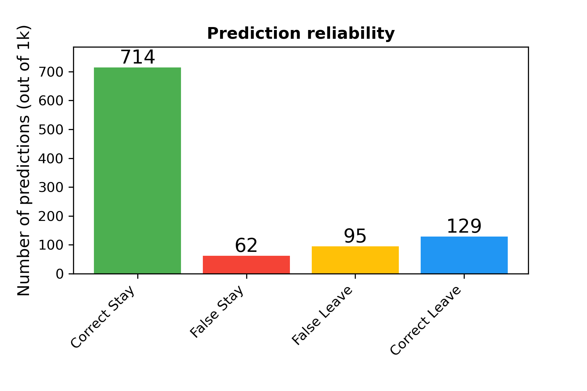

# Banking Customer Churn: Analysis and Prediction
Project: Detecting Customer Churn in Banking

### Project Overview
The goal of this project is to predict customer churn based on various features such as account balance, tenure, estimated salary, and others.

Based on the dataset provided on [Kaggle: Banking Customer Churn Prediction Dataset  ](https://www.https://www.kaggle.com/datasets/saurabhbadole/bank-customer-churn-prediction-dataset), I developed a classification model to identify customers who are at risk of leaving the bank. Since financial data of bank customers is highly sensitive, the dataset does not reflect real-world data but rather describes a hypothetical bank.

Significance: This type of predictive model can be highly valuable for financial institutions aiming to retain their customers. As highlighted by the Harvard Business Review, 


***“Acquiring a new customer can cost 5 to 25 times more than retaining an existing one.”*** 

Customer retention strategies supported by data-driven insights can therefore lead to significant cost savings and improved customer loyalty.


**Goal**: To predict customer churn using relevant features and machine learning techniques.

### Author

[Marcin Grzymowicz](https://github.com/M-Grzymowicz)

## Jupyter Notebooks

This project includes two Jupyter Notebooks, each serving a distinct purpose:

1. **banking_eda.ipynb**: 
This notebook focuses on exploratory data analysis (EDA) of the dataset, presenting key statistics, feature distributions, and their correlation with the target variable (retained vs. churned customers). In addition to the analysis, the notebook produces a data cleaning function that will be reused in the banking_modeling.ipynb notebook.


3. **banking_modelig.ipynb**: 
This notebook focuses on applying various classification models—such as K-Nearest Neighbors, Logistic Regression, and Random Forest—to the preprocessed data from the previous notebook. After evaluating multiple approaches, the optimal model is identified and saved as rf_after_grid_search.pkl.

## Installation and Setup using conda and environment.yml

To set up the project locally, follow these steps:

1. Clone the repository:
```
git clone git@github.com:M-Grzymowicz/Banking_Customer_Churn-Analysis_and_Prediction .git
```
2. Navigate to the project directory:
```
cd your-repository
```
3. Install the required environment (you will obtain a new environment called: dpp-2501)
```
conda env create --file environment.yml
```
4. Activate your environment (dpp-2501):
```
conda activate dpp-2501
```

or use Visual Code Studio and activate this enviroment.


5. Download the original dataset *Churn_Modelling.csv* from [Kaggle: Banking Customer Churn Prediction Dataset  ](https://www.https://www.kaggle.com/datasets/saurabhbadole/bank-customer-churn-prediction-dataset) and place it in the project directory under:  **../data/raw**


**Note:** If any of the above files are missing, the corresponding functionality may not work as intended.

## Results

To find the best model parameters, the F1-score was used.   
This solution ensures a good balance between precision and recall.
However, depending on the banking strategy, solutions that maximize either recall or precision should also be considered.

Classification report of the best model:

              precision    recall  f1-score   support

           0       0.92      0.88      0.90       809
           1       0.58      0.68      0.62       191

    accuracy                           0.84      1000
   macro avg       0.75      0.78      0.76      1000
weighted avg       0.85      0.84      0.85      1000

**Interpretation:**

84% of all predictions (for both retainers and cjurners) are correct.  
58% of predicted churn cases are correct.  
The best model's predictions capture 68% of actual churners.

The diagram below, based on the confusion matrix, provides a more intuitive way to evaluate the quality of the model.





